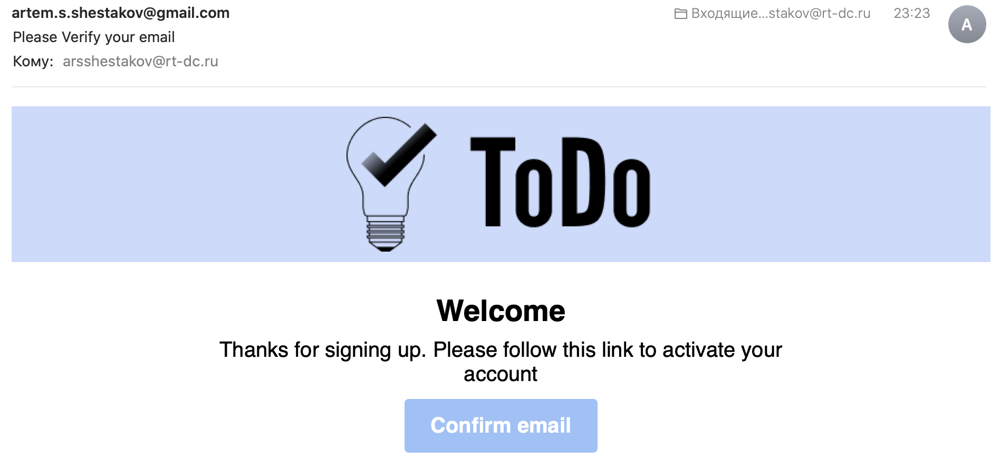

# ToDo_Service

## Capabilities
### Email confirmation


## Init Database
For create user use file init-mongo.js in db directory. Example:
```javascript
db.auth("your admin", "admin's secret")

db = db.getSiblingDB("todo")

db.createUser(
    {
        user: "your user",
        pwd: "user's secret",
        roles: [
            {
                role: "readWrite",
                db: "todo"
            }
        ]
    }
);
```